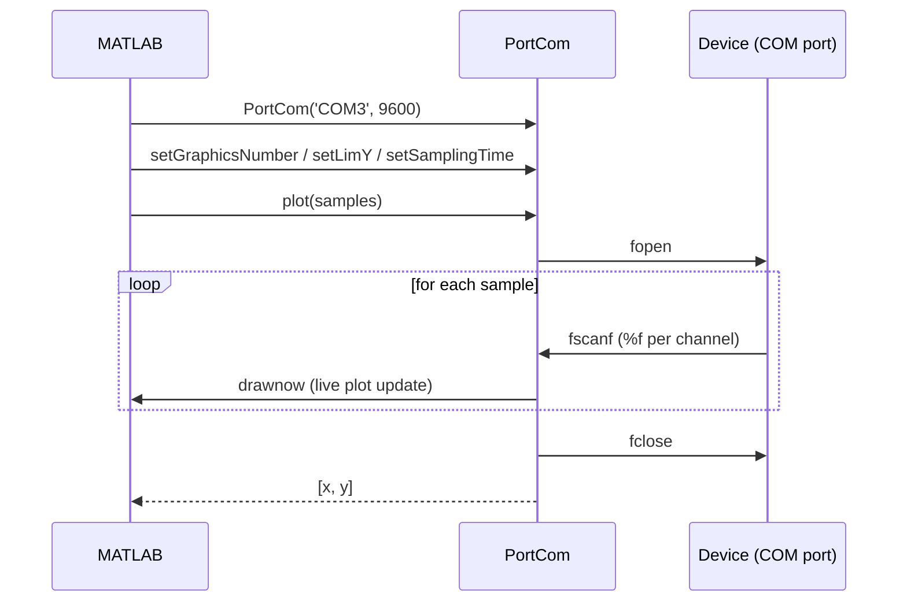

<div align="center">

# 🔌 PortCom

**A lightweight MATLAB class to read, write and live-plot serial port data in just a few lines of code.**


</div>

---

Point `PortCom` at an Arduino, ESP32, or any device streaming numeric values over serial, and get real-time plots and clean captured data back — no boilerplate `serial`/`fopen`/`fscanf` wrangling required.

```matlab
port = PortCom('COM3', 9600);
port.setGraphicsNumber(1);
port.setLimY(0, 5);
[x, y] = port.plot(1000);
```

That's it — a live-updating plot and an `[x, y]` pair ready for analysis.

## Table of contents

- [Features](#features)
- [Requirements](#requirements)
- [Installation](#installation)
- [Quick start](#quick-start)
- [Examples](#examples)
- [API reference](#api-reference)
- [How it works](#how-it-works)
- [FAQ / Troubleshooting](#faq--troubleshooting)
- [Contributing](#contributing)
- [License](#license)
- [Follow me](#follow-me)

## Features

| | |
|---|---|
| 🔌 **Simple serial connection** | Open a port with just a name and baud rate. |
| 📈 **Live plotting** | Stream and plot one or multiple signals in real time, no manual figure handling. |
| 🎨 **Multi-signal support** | Plot several channels at once, each cycling through its own color. |
| 📏 **Configurable Y axis** | Choose fixed limits (`inmobile`) or auto-resizing (`resizable`) as new data arrives. |
| ⏱️ **Accurate time vector** | Set a sampling time and get back a correctly scaled `x` vector with your data. |
| ✍️ **Write support** | Send commands or data back to the connected device. |
| ✅ **Input validation** | Every setter validates its arguments and raises descriptive `PortCom:*` errors. |

## Requirements

- MATLAB with the **Instrument Control Toolbox** (`serial` object support).
- A device connected to a serial/COM port streaming numeric values, one `%f`-compatible number per sample per channel.

## Installation

**Option 1 — clone the repository**

```bash
git clone https://github.com/danny270793/MatlabPortCom.git
```

```matlab
addpath('MatlabPortCom')
```

**Option 2 — copy the file**

Just drop [`PortCom.m`](PortCom.m) into your MATLAB project folder. It has no external dependencies beyond the Instrument Control Toolbox.

## Quick start

```matlab
%% clear workspace
clear all
close all
clc

%% 1. open the connection
port = PortCom('COM4', 9600);

%% 2. configure the plot
port.setGraphicsNumber(2);        % two channels
port.setYLimType('resizable');    % auto-fit the Y axis
port.setLimY(0, 20);              % initial Y range
port.setSamplingTime(20e-3);      % 20 ms between samples

%% 3. capture, plot and get the data back
[x, y] = port.plot(5000);
```

## Examples

Ready-to-run scripts live in [`examples/`](examples):

| Script | What it shows |
|---|---|
| [`basic_read.m`](examples/basic_read.m) | Single channel, fixed Y axis — the simplest possible setup. |
| [`multi_channel_resizable.m`](examples/multi_channel_resizable.m) | Two channels plotted together with an auto-resizing Y axis. |
| [`write_to_port.m`](examples/write_to_port.m) | Sending a command/value back to the connected device. |

Update the `portName`/`baudRate` in each script to match your device, then run it directly in MATLAB.

## API reference

### `PortCom(portName, baudRate)`

Creates and opens a serial port connection.

| Argument | Type | Description |
|---|---|---|
| `portName` | `char` | Port identifier, e.g. `'COM3'` on Windows. |
| `baudRate` | `double` | One of `300, 1200, 2400, 4800, 9600, 19200, 38400, 57600, 115200`. |

```matlab
port = PortCom('COM4', 9600);
```

### `setSamplingTime(samplingTime)`

Sets the sampling interval (seconds) used to generate the time vector `x` returned by `plot`. Must be greater than `0`.

```matlab
port.setSamplingTime(20e-3);
```

### `setGraphicsNumber(graphicsNumber)`

Sets how many signals/channels are read and plotted on each sampling cycle. Must be greater than `0`.

```matlab
port.setGraphicsNumber(2);
```

### `setYLimType(yLimResizable)`

Controls how the Y axis behaves while plotting.

| Value | Behavior |
|---|---|
| `'resizable'` | The Y limits grow/shrink automatically as new data arrives. |
| `'inmobile'` | The Y limits stay fixed to the values set with `setLimY`. |

```matlab
port.setYLimType('resizable');
```

### `setLimY(minY, maxY)`

Sets the initial lower and upper Y axis limits. `minY` must be lower than `maxY`.

```matlab
port.setLimY(0, 20);
```

### `[x, y] = plot(samples)`

Opens the port, reads `samples` measurements per configured channel, plots them live, then returns the captured data.

| Argument | Type | Description |
|---|---|---|
| `samples` | `double` | Number of samples to capture. Defaults to `1000`. |

| Return | Description |
|---|---|
| `x` | Time vector built from `samplingTime`. |
| `y` | Matrix of size `graphicsNumber x samples` with the captured values. |

```matlab
[x, y] = port.plot(5000);
```

### `write(data)`

Sends `data` through the open serial port.

```matlab
port.write('1');
```

## How it works

`PortCom` wraps MATLAB's built-in `serial` object:

1. The constructor validates the port name and baud rate, then opens a `serial` object (not connected to hardware yet).
2. `plot()` opens the port, reads one `%f` value per configured channel on every iteration, updates the figure with `drawnow`, and slides the X window once the data exceeds the plotting interval.
3. When done (or on error), the port is always closed via `fclose`, and captured data is returned as `[x, y]`.
4. `write()` opens the port, writes the given data, and closes it again.



## FAQ / Troubleshooting

**"Invalid baudRate" error** — `baudRate` must be a `double` and exactly one of `300, 1200, 2400, 4800, 9600, 19200, 38400, 57600, 115200`.

**The plot looks frozen / nothing updates** — Make sure your device sends exactly `graphicsNumber` floating point values per sampling cycle; a mismatched channel count stalls `fscanf`.

**Y axis never changes** — Call `setYLimType('resizable')` before `plot()`; the default is `'inmobile'`.

**Port stays "busy" after a crash** — Run `delete(instrfind)` in MATLAB to force-close any lingering serial objects, then try again.

## Contributing

Issues and pull requests are welcome. If you add a new example, drop it in [`examples/`](examples) and link it from the table above.

## License

Distributed under the MIT License. See [license.md](license.md) for details.

## Follow me

[](https://www.youtube.com/channel/UC5MAQWU2s2VESTXaUo-ysgg)
[](https://www.github.com/danny270793/)
[](https://www.linkedin.com/in/danny270793)
